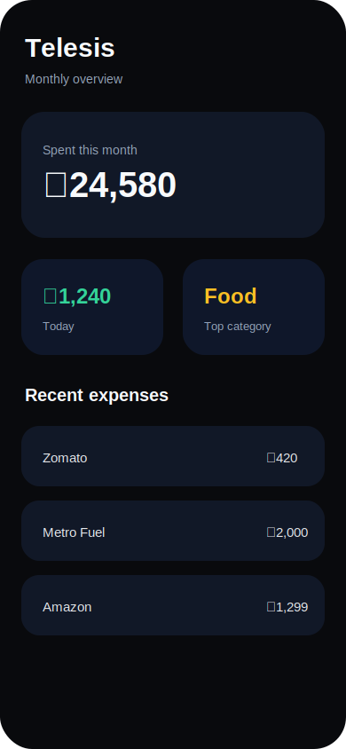
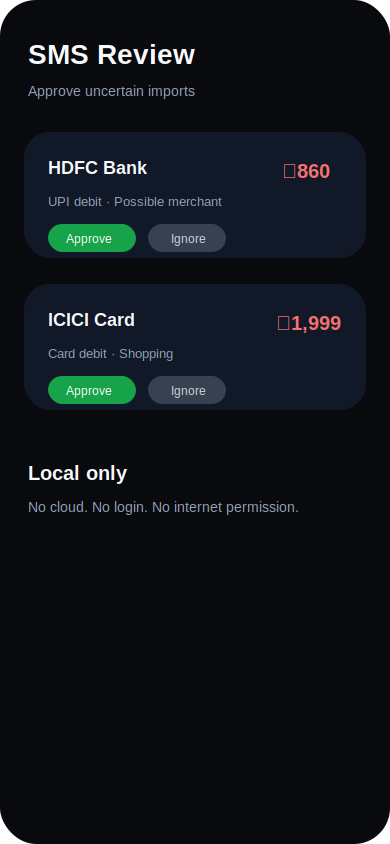
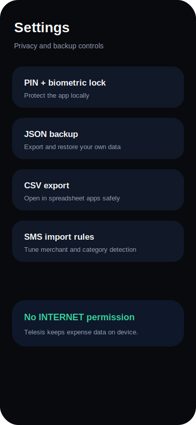
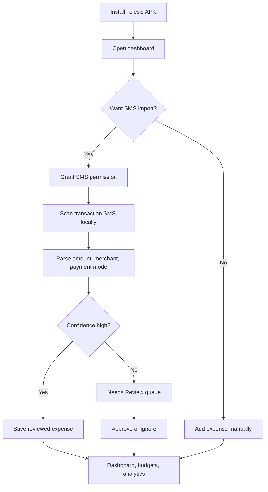

# Telesis

> **A private, local-first Android expense tracker that reads transaction SMS on-device and turns them into a clean personal finance dashboard.**

Telesis is an open-source Android app for people who want a personal expense tracker without cloud lock-in, ads, analytics, accounts, or server-side data collection. It is built natively with **Kotlin**, **Jetpack Compose**, and **Room**.

<p align="center">
  
  
  
</p>

<p align="center">
  <a href="https://github.com/SMITGHORI/telesis/actions/workflows/android-apk.yml"></a>
  <a href="https://github.com/SMITGHORI/telesis/releases"></a>
  
  
</p>

---

## Why Telesis exists

Most finance apps ask for accounts, cloud sync, ads, analytics, bank connectors, or external servers. Telesis takes the opposite route:

- your expenses stay on your phone;
- SMS parsing happens locally;
- there is **no internet permission**;
- there is no Firebase, backend, account system, or analytics SDK;
- exports are user-triggered JSON/CSV files only.

This project is intended for **personal sideloaded use** because Android SMS permissions are sensitive and restricted for public app-store distribution.

---

## Current app identity

| Field | Value |
|---|---|
| App name | **Telesis** |
| Android application ID / bundle identifier | `com.smeet.telesis` |
| Kotlin namespace | `com.smeet.telesis` |
| Version name | `1.0.0` |
| Version code | `100` |
| Minimum Android version | Android 8.0 / API 26 |
| Target SDK | 35 |

The Android `applicationId` is the identifier installed on the phone. For this repo, the installed app ID and Kotlin namespace are both `com.smeet.telesis`.

---

## Core features

### Expense capture

- Manual expense add, edit, date entry, and delete
- SMS inbox import using `READ_SMS`
- Incoming transaction SMS receiver using `RECEIVE_SMS`
- Debit, credit, transfer, ATM, bank, UPI, card, and wallet detection
- Smart amount extraction that avoids common balance/limit amounts
- Merchant extraction and cleanup
- Duplicate SMS prevention using hashes
- Review queue for uncertain imports

### Smart organization

- Auto-created default categories
- Auto-categorization during SMS import
- Custom local SMS rules
- Category budgets
- Recurring expenses
- Due recurring expense generation
- Subscription candidate detection

### Insights

- Monthly spending total
- Today spend card
- Remaining budget card
- Category spend breakdown
- Daily spend bars
- Payment-mode split
- Top merchant insights
- Recent transactions

### Privacy and backup

- No `INTERNET` permission
- No cloud backend
- No Firebase
- No analytics SDK
- No login
- PIN lock
- Biometric/device-credential unlock
- Local JSON backup export
- Local JSON restore/import
- CSV export with spreadsheet formula-injection protection

---

## App flow



---

## Download APK

### Option 1 — GitHub Actions artifact

Every push to `main` builds a debug APK and uploads it as a workflow artifact.

1. Open the **Actions** tab.
2. Open the latest successful **Android APK** workflow run.
3. Download the `telesis-debug-apk` artifact.
4. Extract it and install the APK on your Android phone.

### Option 2 — GitHub Release asset

When a version tag such as `v1.0.0` is pushed, the workflow builds the APK and attaches it to the GitHub Release as:

```text
telesis-v1.0.0-debug.apk
```

Go to **Releases → Latest release → Assets → APK**.

---

## Build locally

Requirements:

- Android Studio
- JDK 17
- Android SDK Platform 35

Build debug APK:

```bash
./gradlew :app:assembleDebug
```

Run unit tests:

```bash
./gradlew :app:testDebugUnitTest
```

Run Android lint:

```bash
./gradlew :app:lintDebug
```

Expected APK path:

```text
app/build/outputs/apk/debug/app-debug.apk
```

Install through ADB:

```bash
adb install -r app/build/outputs/apk/debug/app-debug.apk
```

---

## GitHub Actions APK build

The workflow lives at:

```text
.github/workflows/android-apk.yml
```

It runs:

```bash
./gradlew :app:testDebugUnitTest
./gradlew :app:lintDebug
./gradlew :app:assembleDebug
```

Then it uploads the debug APK as a downloadable GitHub Actions artifact. For version tags, it also publishes the APK as a GitHub Release asset.

---

## SMS permission notice

Telesis requests SMS permissions for one reason: to detect transaction messages on the same phone and convert them into expenses.

Declared sensitive permissions:

```xml
<uses-permission android:name="android.permission.READ_SMS" />
<uses-permission android:name="android.permission.RECEIVE_SMS" />
```

This project is not designed for Play Store distribution. Public distribution with SMS permissions has policy restrictions. Use this app only when you understand and accept the permission model.

---

## Project structure

```text
.
├── app/
│   ├── build.gradle.kts
│   └── src/main/
│       ├── AndroidManifest.xml
│       ├── java/com/smeet/telesis/
│       │   ├── MainActivity.kt
│       │   ├── TelesisApp.kt
│       │   ├── core/
│       │   ├── data/
│       │   ├── sms/
│       │   ├── ui/
│       │   └── util/
│       └── res/
├── docs/screenshots/
├── .github/workflows/android-apk.yml
├── CHANGELOG.md
├── VERSION.md
└── README.md
```

---

## License

Telesis is released under the MIT License. See [`LICENSE`](LICENSE).

---

## Open-source status

This is a personal, privacy-first Android project. Contributions should preserve the core promise:

```text
No backend. No Firebase. No analytics. No internet permission. Local-first by default.
```

Before proposing cloud sync, accounts, or third-party integrations, open a discussion explaining how the feature preserves privacy and user control.
